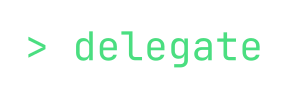

<p align="center">
  
</p>

<p align="center">
  <strong>An engineering manager for your AI agents.</strong><br>
  <sub>Delegate plans, staffs, coordinates, and delivers — you review the results.</sub>
</p>

<p align="center">
  <a href="https://pypi.org/project/delegate-ai/"></a>
  <a href="LICENSE"></a>
  <a href="https://www.python.org/downloads/"></a>
</p>

---

Tools like Cursor, Claude Code, and Copilot are excellent **copilots** — they help you write code faster. But you're still the one driving: one task at a time, synchronous, hands-on.

Delegate is the layer above. It's an **engineering manager** that runs persistent teams of AI agents on your machine. Tell it what you want in plain English — Delegate breaks the work into tasks, assigns agents, manages code reviews between them, and merges the result. You review the output, not write the code.

Spin up a team per project — a backend API, a mobile app, a data pipeline — each with its own agents, repos, and context. Within each project, agents work on multiple tasks in parallel: one builds a feature while another fixes a bug and a third refactors a module. Across projects, teams run independently and simultaneously. You manage a portfolio of work, not a single cursor.

A copilot makes **you** a faster developer. Delegate gives you **teams** that ship while you focus on what matters.

> **Note:** Delegate currently works with **local git repositories** — agents commit directly to branches on your machine. Support for remote repositories (GitHub, GitLab), external tools (Slack, Linear), and CI/CD integrations is coming soon.

<!-- TODO: Replace with an actual screenshot or demo GIF
<p align="center">
  
</p>
-->

### How is this different from other AI coding tools?

| | Copilots (Cursor, Copilot, Claude Code) | Delegate |
|---|---|---|
| **You are** | The developer — AI assists | The executive — AI delivers |
| **Scope** | One file, one task | Many projects, many tasks in parallel |
| **Context** | Fresh each session | Persistent across weeks of work |
| **Agents** | One, disposable | Teams that coordinate and review each other |
| **Output** | Code suggestions and edits | Reviewed, tested, merge-ready branches |
| **Workflow** | You drive every step | You set direction, check in when you want |

This isn't a replacement for copilots — it's a different level of abstraction. Use Cursor to pair-program on a tricky function. Use Delegate to hand off "build the auth system" and come back to a reviewed PR.

## Quickstart

> **Requires Python 3.12+.** Check with `python3 --version`.
> On macOS: `brew install python@3.13` · On Ubuntu: `sudo apt install python3.12` · Or download from [python.org](https://www.python.org/downloads/).

```bash
pip install delegate-ai
cd to/directory/having/git/repo # optional, just makes config easier
delegate start # needs claude code login or ANTHROPIC_API_KEY in ENV
```

That's it. Delegate spins up a team with a manager + 5 engineer agents
and opens the console in your browser. Tell Delegate what to build — it plans the work, assigns agents, and manages delivery. You review the results. Add more projects anytime with `delegate team add`.

## What happens when you send a task

```
You: "Add a /health endpoint that returns uptime and version"
```

1. **Delegate** (the manager agent) breaks it down, creates tasks, assigns to available engineers
2. **Engineer** gets a git worktree, writes the code, runs tests, submits for review
3. **Reviewer** (another agent) checks the diff, runs the test suite, approves or requests changes
4. **You** approve the merge (or set repos to auto-merge)
5. **Merge worker** rebases onto main, runs pre-merge checks, fast-forward merges

Meanwhile, you can send more tasks — Delegate will prioritize, assign, and multiplex across the team. All of this is visible in real-time in the web UI.

## Key features

**Many projects, many tasks, all at once.** Spin up a team per project — each with its own agents, repos, and accumulated context. Within each project, agents tackle multiple tasks in parallel, each in its own git worktree. Across projects, teams run independently. Your throughput scales with the number of teams, not with your attention. Zero cost when a team is idle.

**Persistent teams, not disposable agents.** Create a team once, use it across hundreds of tasks. Agents maintain memory — journals, notes, context files — so they learn your codebase, conventions, and patterns over time. Like a real team, they get better the longer they work together.

**Async by default.** You don't need to sit and watch. Send Delegate a task, close your laptop, come back later. The team keeps working — writing code, reviewing each other, running tests. Check in when you want. This is the fundamental difference from copilots, which require your continuous presence.

**Agents that coordinate, not just execute.** Engineers don't work in isolation. When one agent finishes coding, another reviews the diff and runs the test suite. Tasks flow through `todo → in_progress → in_review → in_approval → merging → done` with agents handling each transition — just like a well-run engineering team.

**Browser UI with real-time visibility.** Watch agents pick up tasks, write code, and review each other's work — live. Approve merges, browse diffs, inspect files, and run shell commands — all from the browser.

**Works with your existing setup.** Delegate reads `claude.md`, `AGENTS.md`, `.cursorrules`, and `.github/copilot-instructions.md` from your repos automatically — no migration needed.

**Real git, real branches.** Each agent works in isolated [git worktrees](https://git-scm.com/docs/git-worktree). Branches are named `delegate/<team>/T0001`. No magic file systems — you can `git log` any branch anytime.

**Customizable workflows.** Define your own task lifecycle in Python:

```python
from delegate.workflow import Stage, workflow

class Deploy(Stage):
    label = "Deploying"
    def enter(self, ctx):
        ctx.run_script("./deploy.sh")

@workflow(name="with-deploy", version=1)
def my_workflow():
    return [Todo, InProgress, InReview, Deploy, Done]
```

**Mix models by role.** All agents default to Claude Sonnet. Override per agent with `--model opus` for tasks requiring stronger reasoning.

**Team charter in markdown.** Set review standards, communication norms, and team values in a markdown file — like an EM setting expectations for the team.

**Built-in shell.** Run any command from the chat with `/shell ls -la`. Output renders inline.

**Installable as an app.** Delegate's web UI is a [Progressive Web App](https://developer.mozilla.org/en-US/docs/Web/Progressive_Web_Apps) — install it from your browser for a native app experience.

## Architecture

```
~/.delegate/
├── members/              # Human identities (from git config)
│   └── nikhil.yaml
├── teams/
│   └── my-project/
│       ├── agents/       # delegate (manager) + engineer agents
│       │   ├── delegate/ # Manager agent — your delegate
│       │   ├── alice/    # Engineer agent with worktrees, logs, memory
│       │   └── bob/
│       ├── repos/        # Symlinks to your real git repos
│       ├── shared/       # Team-wide shared files
│       └── workflows/    # Registered workflow definitions
└── db.sqlite             # Messages, tasks, events
```

Agents are [Claude Code](https://docs.anthropic.com/en/docs/claude-code) instances. The Delegate agent is the EM — it reads your messages, breaks down work, assigns tasks, and coordinates the team. Engineers work in git worktrees and communicate through a message bus. The daemon dispatches agent turns as async tasks, multiplexing across the whole team. All storage is local files — plaintext or sqlite.

There's no magic. You can `ls` into any agent's directory and see exactly what they're doing. Worklogs, memory journals, context files — it's all plain text.

## Sandboxing & Permissions

Delegate restricts what agents can do through six independent layers — defense-in-depth so no single bypass compromises the system:

**1. Write-path isolation (`can_use_tool` callback)**

Every agent turn runs with a programmatic guard that inspects each tool call before it executes. The `Edit` and `Write` tools are only allowed to target files inside explicitly permitted directories:

| Role | Allowed write paths |
|------|-------------------|
| Manager | Entire team directory (`~/.delegate/teams/<team>/`) |
| Engineer | Own agent directory, task worktree(s), team `shared/` folder |

Writes outside these paths are denied with an error message — the model sees the denial and can adjust.

The same guard also enforces a **bash deny-list** — commands containing dangerous substrings are blocked before execution:

```
sqlite3, DROP TABLE, DELETE FROM, rm -rf .git
```

This prevents agents from directly manipulating the database or destroying git metadata, even if they attempt it via bash.

**2. Disallowed git commands (`disallowed_tools`)**

Git commands that could change branch topology, interact with remotes, or rewrite history are hidden from agents entirely at the SDK level:

```
git rebase, git merge, git pull, git push, git fetch,
git checkout, git switch, git reset --hard, git worktree,
git branch, git remote, git filter-branch, git reflog expire
```

Agents never see these tools and cannot invoke them — branch management is handled by Delegate's merge worker instead.

**3. OS-level bash sandbox (macOS Seatbelt / Linux bubblewrap)**

All bash commands run inside an OS-level sandbox provided by Claude Code's native sandboxing. The sandbox restricts filesystem writes to:

- The team's working directory (`~/.delegate/teams/<uuid>/`) — not the entire `DELEGATE_HOME`, so `protected/` and other teams' directories are never writable from bash
- Platform temp directory (`/tmp` on Unix, `%TEMP%` on Windows)
- Each registered repo's `.git/` directory — so `git add` / `git commit` work inside worktrees without opening the repo working tree to arbitrary bash writes. All agents (including managers) get `.git/` access.

Even if the model crafts a bash command that bypasses the tool-level guards, the kernel blocks the write. Agents cannot `git` into unregistered repos (the sandbox blocks writes to their `.git/`), and they cannot write to the working tree of any repo via bash (only `.git/` is allowed).

**4. Network domain allowlist**

Agents' network access is controlled via a domain allowlist stored in `protected/network.yaml` (outside the sandbox, so agents can't tamper with it). By default, all domains are allowed (`*`). When restricted to specific domains, the sandbox blocks outbound connections to anything not on the list.

```bash
delegate network show                    # View current allowlist
delegate network allow api.github.com    # Add a domain
delegate network disallow example.com    # Remove a domain
delegate network reset                   # Reset to wildcard (allow all)
```

**5. In-process MCP tools (protected data access)**

Agents interact with the database, task system, and mailbox through in-process MCP tools that run inside the daemon (outside the agent sandbox). This means agents never need shell access to `protected/` — all operations go through validated code paths. Agent identity is baked into each tool closure, preventing impersonation: an agent cannot send messages as another agent or access data outside its team.

**6. Daemon-managed worktree lifecycle**

Git operations that modify branch topology — `git worktree add`, `git worktree remove`, branch creation, rebase, and merge — run exclusively in the **daemon process**, which is unsandboxed. Agents never run these commands directly. When a manager creates a task with `--repo`, only the DB record and branch name are saved; the daemon creates the actual worktree before dispatching any turns to the assigned worker. This clean separation means agents can write code and commit inside their worktrees but cannot create, remove, or manipulate worktrees or branches.

Together these six layers mean: the model can only write to directories Delegate explicitly allows, cannot touch your git branch topology, cannot access the database directly, cannot contact unauthorized domains, cannot escape the sandbox even through creative bash commands, and all infrastructure operations happen in a controlled daemon context.

## Configuration

### Environment

```bash
# Required — your Anthropic API key
ANTHROPIC_API_KEY=sk-ant-...

# Optional
DELEGATE_HOME=~/.delegate    # Override home directory
```

### CLI commands

```bash
delegate start [--port 3548] [--env-file .env]   # Start everything
delegate stop                                     # Stop the daemon
delegate status                                   # Check if running

delegate team add backend --agents 3 --repo /path/to/repo
delegate team list
delegate repo add myteam /path/to/another-repo --test-cmd "pytest -x"
delegate agent add myteam carol --role engineer

delegate workflow init myteam                     # Register default workflow
delegate workflow add myteam ./my-workflow.py     # Register custom workflow

delegate network show                             # View network allowlist
delegate network allow api.github.com             # Allow a domain
delegate network disallow example.com             # Remove a domain
delegate network reset                            # Reset to allow all
```

### Set Auto Approval

By default, Delegate expects you to do a final code review and give explicit
approval before merging into your local repo's main. If you wanted, you can set 
it to auto approval:

```bash
delegate repo set-approval myteam my-repo auto
```

## How it works

The **daemon** is the central loop:
- Polls agent inboxes for unread messages
- Dispatches turns (one agent at a time per agent, many agents in parallel)
- Processes the merge queue
- Serves the web UI and SSE streams

**Agents** are stateless between turns. Each turn:
1. Read inbox messages
2. Execute actions (create tasks, write code, send messages, run commands)
3. Write context summary for next turn

The **workflow engine** is a Python DSL. Each task is stamped with a workflow version at creation. Stages define `enter`/`exit`/`action`/`assign` hooks. Built-in functions (`ctx.setup_worktree()`, `ctx.create_review()`, `ctx.merge_task()`, etc.) handle git operations, reviews, and merging.

## Development

```bash
git clone https://github.com/nikhilgarg28/delegate.git
cd delegate
uv sync
uv run delegate start --foreground
```

### Tests

```bash
# Python tests
uv run pytest tests/ -x -q

# Playwright E2E tests (needs npm install first)
npm install
npx playwright install
npx playwright test
```

## Roadmap

Delegate is under active development. Here's what's coming:

- ~~**Sandboxing & permissions**~~ — ✅ shipped in v0.2.5 (OS-level sandbox + write-path isolation + git command restrictions).
- **More powerful workflows** — conditional transitions, parallel stages, human-in-the-loop checkpoints, and webhook triggers.
- **External tool integrations** — GitHub (PRs, issues), Slack (notifications, commands), Linear (task sync), and CI/CD pipelines (GitHub Actions, etc.).
- **Remote repositories** — push to and pull from remote Git hosts, not just local repos.
- **Exportable team templates** — package a team's configuration (agents, workflows, charter, repo settings) as a shareable template so others can spin up an identical setup in one command.

If any of these are particularly important to you, open an issue — it helps prioritize.

## About

Delegate is built by a solo developer as a side project — and built *with* Delegate. No VC funding, no growth targets — just a tool I wanted for myself and decided to open-source. MIT licensed, free forever.

If you find it useful, star the repo or say hi in an issue. Bug reports and contributions are welcome.

## License

[MIT](LICENSE)
